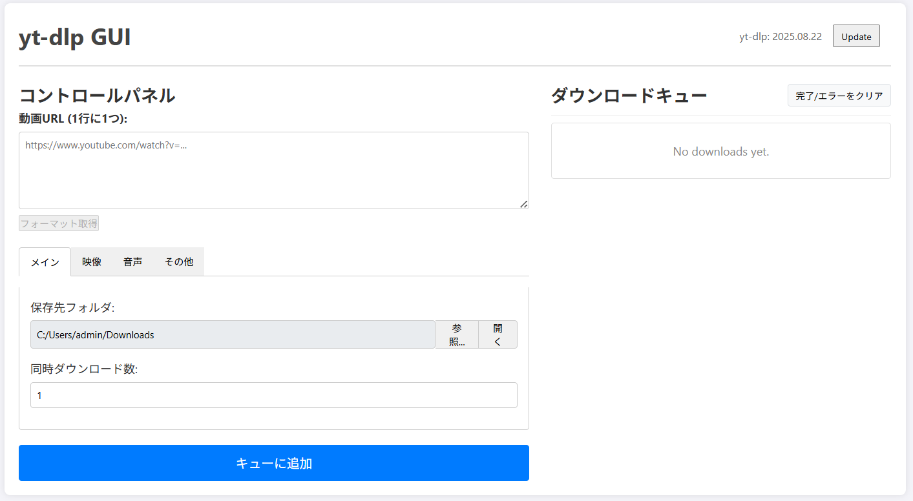

# GUI-ytdlp

yt-dlpのWebインターフェースを提供するFlask/Socket.IOベースのアプリケーション

## 使用イメージ

### メイン画面



**主な機能説明:**

- **コントロールパネル（左側）**: URL入力、フォーマット選択（メイン/映像/音声/その他）、保存先フォルダ設定、同時ダウンロード数設定
- **ダウンロードキュー（右側）**: 進行中・完了済みダウンロードの一覧表示とステータス確認
- **yt-dlp更新機能**: 最新バージョンのyt-dlpに簡単アップデート（右上のUpdateボタン）

## 重要な注意事項・免責事項

**このツールをご利用になる前に、必ずお読みください。**

### 著作権・利用規約の遵守について

- このツールは個人的な利用および教育目的でのみ使用してください
- ダウンロードするコンテンツの著作権および各プラットフォームの利用規約（YouTube利用規約等）を遵守する責任は、すべて利用者にあります
- 著作権保護されたコンテンツの無断ダウンロードは、お住まいの国や地域の法律に違反する可能性があります
- 商用利用や再配布は行わないでください

### YouTube利用規約への配慮

- YouTubeの利用規約では、明示的に許可されている場合を除き、コンテンツのダウンロードは禁止されています
- YouTube Premiumサブスクライバーのオフライン機能など、公式に提供されているサービスの利用を推奨します
- 本ツールの使用は利用者の自己責任で行ってください

### 免責事項

- 本ツールの使用によって生じたいかなる法的問題、損害、トラブルについても、開発者は一切の責任を負いません
- 利用者は自身の責任において、適用される法律および各サービスの利用規約を確認し、遵守してください
- 本ツールは教育・研究目的で開発されており、違法行為を助長する意図はありません

## ファイル構造

```
/GUI-ytdlp
├── app/                        # メインアプリケーション
│   ├── __init__.py             # Flaskアプリファクトリ
│   ├── views.py                # HTTP APIエンドポイント
│   ├── sockets.py              # WebSocket通信ハンドラー
│   ├── ytdlp_handler.py        # yt-dlp操作・フォーマット処理
│   ├── settings_handler.py     # 設定管理
│   └── translations.py         # 多言語対応
│
├── static/
│   ├── css/
│   │   └── style.css           # メインスタイル
│   └── js/
│       ├── main.js             # エントリーポイント
│       ├── ui.js               # UI操作・レンダリング
│       ├── socket.js           # WebSocket通信
│       ├── api.js              # HTTP API通信
│       └── state.js            # アプリケーション状態管理
│
├── templates/
│   └── index.html              # メインテンプレート
│
├── tools/
│   └── yt-dlp.exe              # yt-dlp本体（自動ダウンロード）
├── downloads/                  # ダウンロードファイル保存先(デフォルト)
├── images/
│   └── screenshot-main.png     # スクリーンショット
├── run.py                      # アプリケーション起動スクリプト
├── folder_selector.py          # フォルダ選択ダイアログ
├── requirements.txt            # Python依存関係
├── settings.json               # ユーザー設定ファイル
├── start.cmd                   # Windows用起動バッチ
```

## セットアップ

### セットアップ・起動方法（Windows）

1. 必要に応じてPythonをインストールしてください。
2. コマンドプロンプトで本フォルダに移動し、`start.cmd` をダブルクリックまたは以下のコマンドで実行してください：

```cmd
start.cmd
```

初回起動時は自動的に仮想環境の作成・依存関係のインストール・サーバー起動が行われます。

ブラウザで <http://127.0.0.1:5000> にアクセスしてください。

## アンインストール方法


1. アプリケーションを終了してください。
2. 以下のフォルダ・ファイルを手動で削除してください：
   - venv/（仮想環境）
   - downloads/（ダウンロード済みファイル）
   - settings.json（設定ファイル）
   - このリポジトリのフォルダ自体
3. 依存パッケージやPython本体は他の用途がなければアンインストールしてください。

## 主要機能

- 動画・音声ダウンロード（YouTube等対応サイト）
- リアルタイム進捗表示
- 並列ダウンロード
- 詳細フォーマット選択
- Cookie対応（ログイン必要動画）
- 多言語対応（日本語・英語）

## 法的な利用について

本ツールを使用する際は、以下の点にご注意ください：

1. **パブリックドメインコンテンツ**: 著作権が切れた作品やクリエイティブ・コモンズライセンスの作品
2. **自作コンテンツ**: ご自身が制作・投稿したコンテンツのバックアップ
3. **明示的に許可されたコンテンツ**: ダウンロードが明示的に許可されているコンテンツ
4. **教育・研究目的**: 学術研究や教育目的での利用（ただし、各機関のガイドラインに従ってください）


